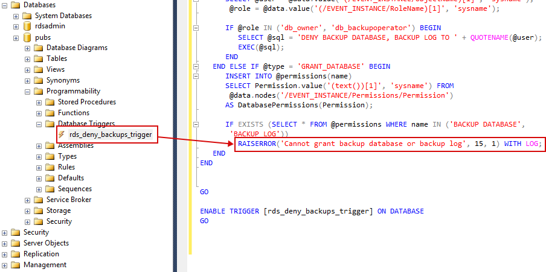
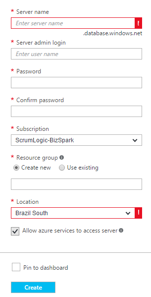
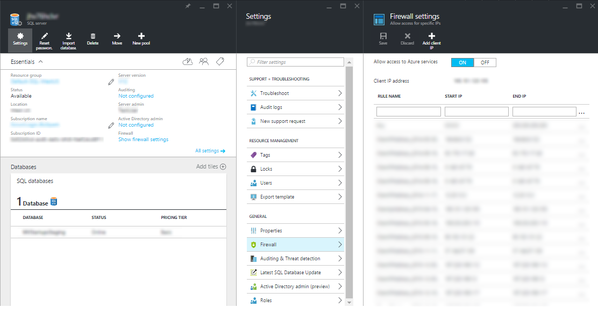
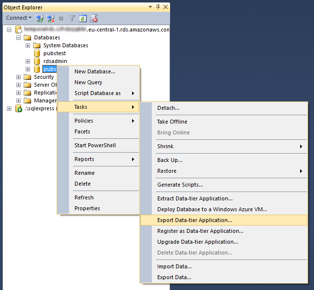
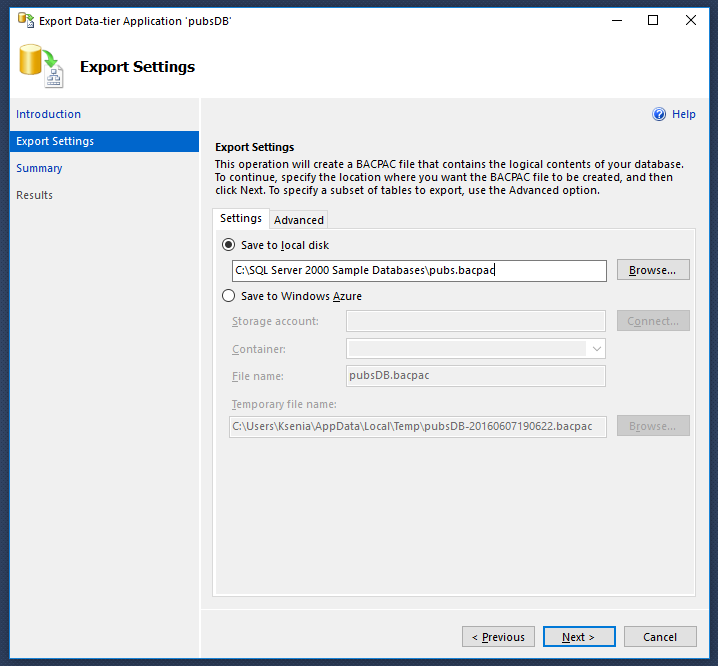
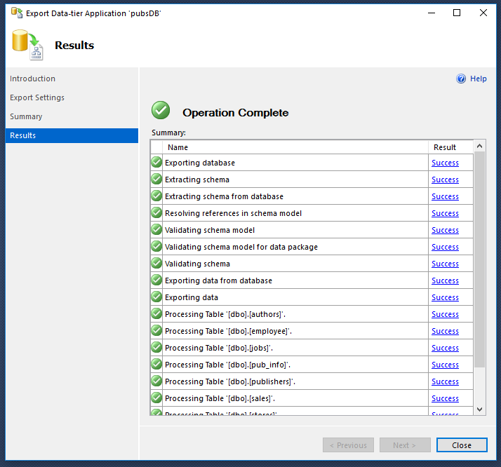
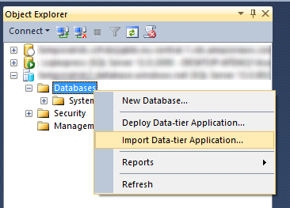
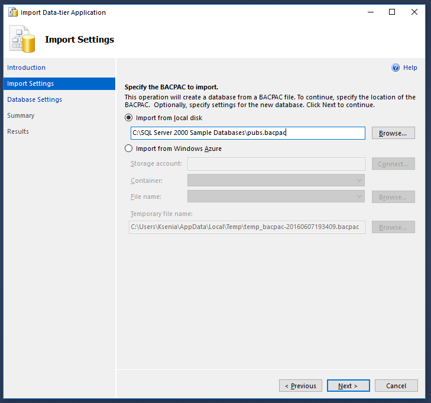
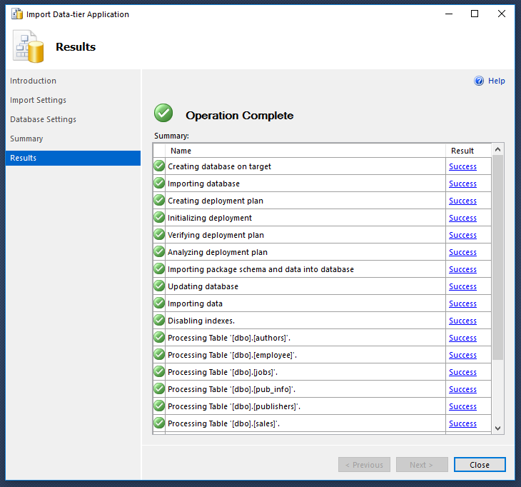

##AWS RDS to Azure SQL migration

###OVERVIEW

This article describes the migration of a sample MS SQL Server database from Amazon Relational Database Service (Amazon RDS) to Azure SQL Service.  This article is also available in PDF format [here] (media/PDF-files/AWS RDS to Azure SQL migration.pdf).

If you have any feedback on the documentation please log the feedback via an [issue] (https://github.com/Azure-for-Startups/Azure-IoT-demo/issues).

###PREREQUISITES
To perform the steps below you will need the SQL Server Management Studio 2014 (version 12.0.4213.0 or later) or SQL Server Management Studio 2016 CTP2.3 (version 13.0.500.53) to be installed: 

-   Get Microsoft SQL Server 2014 here: https://www.microsoft.com/en-US/download/details.aspx?id=42299 (click Download button, choose “Express 64BIT\SQLEXPR_x64_ENU.exe” or “Express 32BIT\SQLEXPR_x86_ENU.exe” and “MgmtStudio 64BIT\SQLManagementStudio_x64_ENU.exe” or “MgmtStudio 32BIT\SQLManagementStudio_x86_ENU.exe” depending on your system type).
-   The 2016 CTP2.3 version can be downloaded here: https://msdn.microsoft.com/library/mt238290.aspx. 

In the article we will use a well-known sample “pubs” database which can be downloaded here: http://www.microsoft.com/en-us/download/details.aspx?id=23654. To restore the “pubs” base launch the downloaded application “SQL2000SampleDb.msi” and follow the installation guide. The needed file “PUBS.mdf” will appear in “C:\SQL Server 2000 Sample Databases” folder. Open SQL Server Management Studio and connect to your Amazon Relational Database Service. Right-click Databases and click Attach. In the Attach Databases dialog box click Add and choose “PUBS.mdf” file. Click Ok and wait for the database attachment. So now we have the “pubs” database deployed on the AWS RDS MS SQL Express instance. 

IMPORTANT: please note that during creation any new database AWS RDS adds the database trigger named “rds_deny_backups_trigger” which contains the “RAISERROR () WITH LOG” call. 

This call prevents the database from being migrated to Azure SQL. So don’t forget to remove this trigger before starting the migration. 

###GOALS

1.	Migrate the existing database schema from AWS RDS to Azure SQL. 
2.	Migrate the existing database data from AWS RDS to Azure SQL. 

###CREATING THE AZURE SQL
SERVER INSTANCE

Create the Azure SQL Server instance via the Azure Management Console: 

Don’t forget to go to the SQL Server Instance configuration tab and allow your IP address to connect to the server (SQL server -> Settings -> All Settings -> Firewall): 

Do the same on the AWS RDS side as well, if you haven’t done this before. 

###MIGRATION PROCESS

To start the migration process, you need to launch the SQL Server Management Studio and connect to the AWS RDS SQL Server Instance. Then please select the “Export Data-tier Application...” task for “pubs” database: 

After that you will see the Introduction window, click Next. The Export Settings window will be opened, choose “Save to local disc” setting, click Browse and choose the path to file, which will be generated: 

Click Next and Finish in the next window. Wait for the processing. In several seconds you will see the result window:

The next step is to connect to the Azure SQL Server Instance. Right-click on the Database item, select the “Import Data-tier Application...” task: 

After the Introduction window you will see the Import Settings window. Choose “Import from local disk”, click Browse and choose the path to file, which was generated during exporting operation before: 

Click Next. In Database Settings window enter the new database name, click Next and Finish in the next window. 
Wait for the processing. In several minutes you will see the result window: 

Click Close and check that the database has been migrated correctly: 

