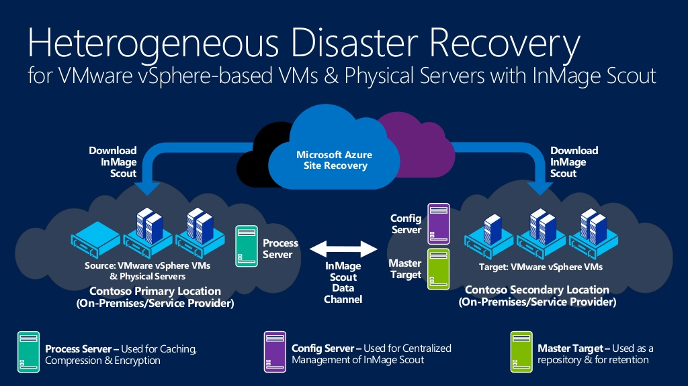
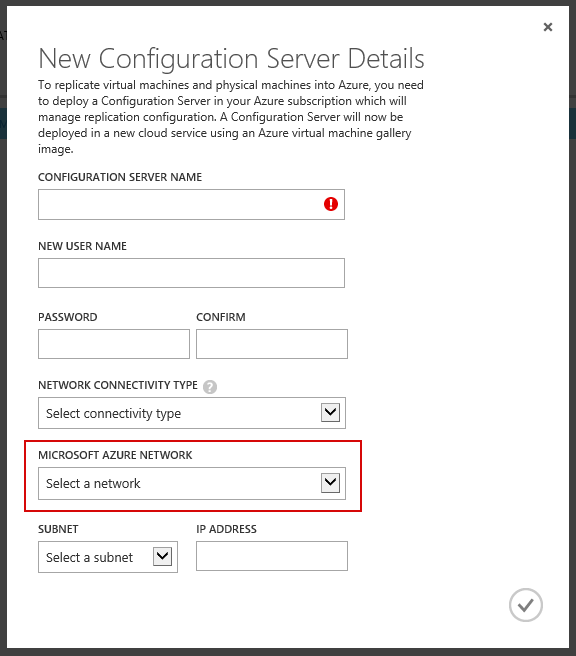
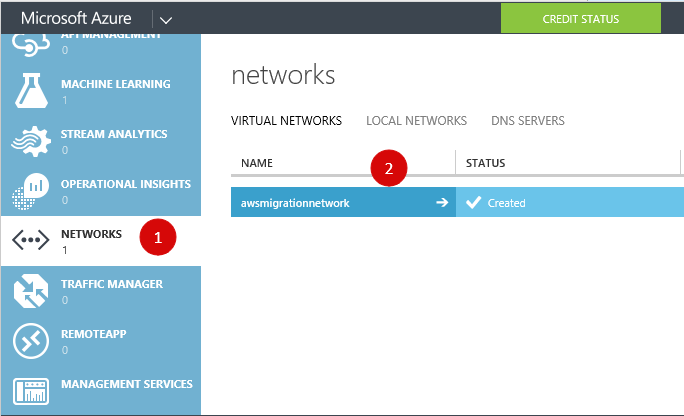
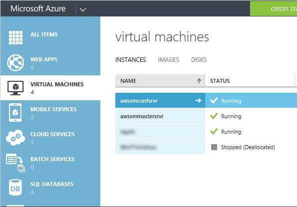
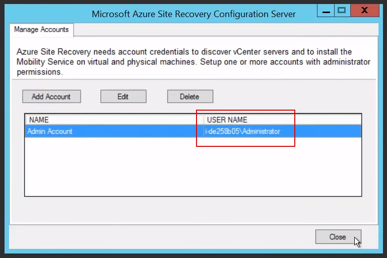
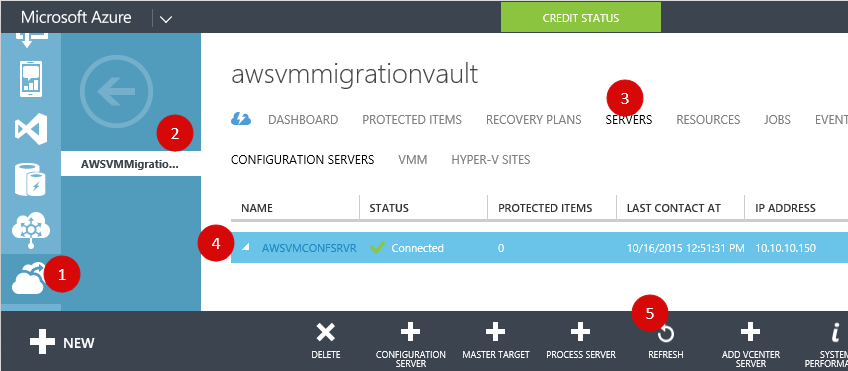
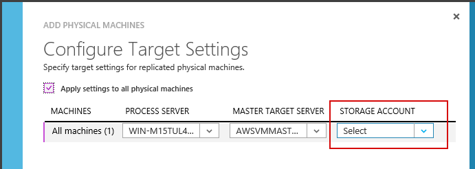

##AWS Virtual Machine to Azure Virtual Machine Migration

###OVERVIEW
This article describes how to migrate a Windows or Linux driven Virtual Machine from Amazon Web Services (AWS) to Azure Cloud Services. We describe the two most popular migration flows: the first requires quite a bit of manual work while the second is the latest method which uses the latest features of the Azure Cloud Services.  This article is also available in PDF format [here] (media/PDF-files/AWS VM to Azure VM migration.pdf).

If you have feedback on the documentation please log the feedback via an [issue] (https://github.com/Azure-for-Startups/Content/issues).

###Migration via the VHD file export-conversion-import
This is a standard migration flow using export/import of the machine image. AWS allows you to download a VM from their service. The downloaded image can be converted to format-ready for Hyper-V use and uploaded to Azure, however, this would involve a lengthy down time of the service during the download, conversion, and upload. Also the process involves utilizing a Disk2VHD tool which is available for Windows only. For Linux you will have to use an alternative tool (dd or other).  

###Migration using the Azure site recovery service
Another way is to use the [free Microsoft Migration Accelerator] (https://azure.microsoft.com/en-us/blog/introducing-microsoft-migration-accelerator/), which uses the same technology as [Azure Site Recovery] (https://azure.microsoft.com/en-us/services/site-recovery/) and is based on the [InMage Scout] (http://windowsitpro.com/azure/inmage-scout) technology.  

##PREREQUISITES
As a starting point, you need to have the Virtual Machine on AWS.   

##GOALS
Migrate the existing VM instance from AWS to Azure.  

MIGRATION VIA THE VHD
FILE EXPORT-CONVERSION-IMPORT

Keith Mayer has published a great video series about the Migration Windows driven Virtual Machine from AWS to Azure. You can find the entire series on Channel 9 [*here*](https://channel9.msdn.com/Series/Migrating-Virtual-Machines-from-Amazon-AWS-to-Microsoft-Azure)
(including an episode named “Why Migrate from Amazon AWS to Azure?”) or [*here*](https://channel9.msdn.com/Shows/TechNet+Radio/TechNet-Radio-How-to-Migrate-Your-Virtual-Machines-from-Amazon-Web-Services-to-Windows-Azure)
as one video file.  

##MIGRATIONS USING THE AZURE SITE RECOVERY SERVICE

##Migration of the Windows
Driven VM
Several good resources have been published, among our top recommendations are:  

- A step by step guide in written form by Rayne Wiselman which can be found [*here*](https://azure.microsoft.com/en-us/documentation/articles/site-recovery-migrate-aws-to-azure/)

- A PowerPoint presentation by Alexandre Verkinderen [*here*](http://www.slideshare.net/alexandreverkinderen/expertslive-azure-site-recovery)

- A great video guide by Rajesh Goli about migration using Azure Site Recovery service which you can view [*here*](https://azure.microsoft.com/en-us/blog/seamlessly-migrate-your-application-from-aws-to-azure-in-4-simple-steps/).  A few important notes and clarification on this video:

- 1. During the Configuration Server setup Rajesh selects the related Microsoft Azure Network. So you have to configure the Azure Network before starting the Configuration Server creation, as shown below.

*Here is the sample of the created Azure Network:*

 

- 2. If you don’t see created instances in the Virtual Machine list use the F5 button to reload the page.

- 3. During configuration of the Microsoft Azure Site Recovery Configuration Server, Rajesh has used a partially hidden User Name.   

- 4. This User Name has been constructed from the AWS instance ID + “Administrator” account name: 

- 5. And you will see it show upon the next screen in the video:

- 6. During the Target Server configuration, the empty “master target server” list appears to be empty in the Azure Portal: 

- 7.To refresh the list, you have to refresh the Configuration Server as shown below: 

 

- 8.Refreshing the Configuration Server is the same job as creating and could be tracked via the JOBS tab. After the job is done you can come back to the list and you should see the created Target Server in the list. 
  
- 9.During the step of adding the Physical Machines to the Protection Group you will be asked to select the Storage Account. Please create it before adding the Physical Machines.

> 

Migrating a Linux Driven
VM

We recommend using [*this*](https://azure.microsoft.com/en-us/documentation/articles/site-recovery-migrate-aws-to-azure/) guide by Rayne Wiselman, with a few recommended adjustments:
<ol type="1">
<li>Ensure that you have installed the latest Linux Integration Services (LIS) before you install the Master Target Server software. You can find the latest version of LIS along with instructions on how to install it [*here*](https://www.microsoft.com/en-us/download/details.aspx?id=46842).  The PDF file (“Linux Integration Services v4-0-11.pdf”) includes an installation guide.   </li>

<li>During install of the Additional Software for the Master Target Server use the following link:    </li> [*http://download.microsoft.com/download/7/E/D/7ED50614-1FE1-41F8-B4D2-25D73F623E9B/Microsoft-ASR\_UA\_8.4.0.0\_RHEL6-64\_GA\_28Jul2015\_release.tar.gz*](http://download.microsoft.com/download/7/E/D/7ED50614-1FE1-41F8-B4D2-25D73F623E9B/Microsoft-ASR_UA_8.4.0.0_RHEL6-64_GA_28Jul2015_release.tar.gz)

To download via the widget instead of the original one use the following link: [*http://go.microsoft.com/fwlink/?LinkID=529757&clcid=0x409*](http://go.microsoft.com/fwlink/?LinkID=529757&clcid=0x409)

Also don't forget to create the directory and extract the archive as it contains the needed batch of files inside.

<li>Be sure to enable the password based SSH authentication on the machine, because AWS enables authentication by key by default.  </li>
</ol>
